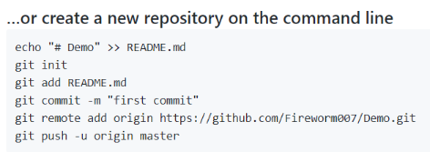

#### 埃森哲JAVA后端的练习Demo
Q1:在添加spring boot 根据
[SpringBoot创建多模块工程](https://blog.csdn.net/qq_39839075/article/details/83311925)
多子模块的时候，无法继承父工程的依赖版本,还需要在父工程的dependency中明确版本号。  

主要原因是不清楚dependency和dependencyManagement之间的区别：
[Maven实战（六）--- dependencies与dependencyManagement的区别](https://blog.csdn.net/liutengteng130/article/details/46991829)
